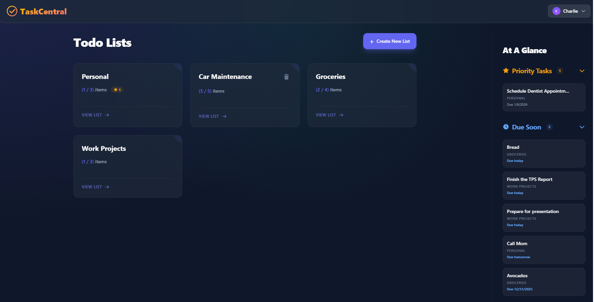
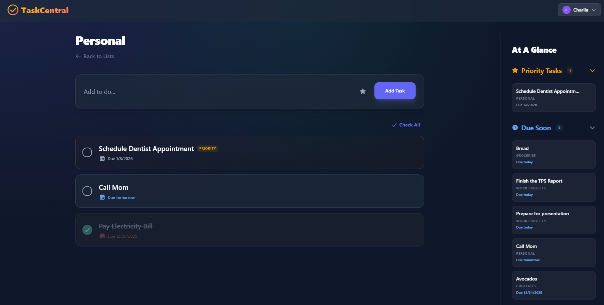

# TaskCentral

A modern, full-stack task management demo featuring a .NET Core API backend and a reactive Vue.js 3 frontend. Supports multiple todo lists, priority items, due dates, and a sidebar to provide at-a-glance access.

## Tech Stack

### Backend (`TaskCentralBackEnd`)
- **Framework**: ASP.NET Core Web API
- **Database**: SQLite via Entity Framework Core
- **ORM**: Entity Framework Core

### Frontend (`TaskCentralWebApp`)
- **Framework**: Vue.js 3 (Composition API) + Vue Router
- **Styling**: Tailwind CSS v4
- **Testing **: Vitest

## How to Run

### Prerequisites
- [.NET 8 SDK](https://dotnet.microsoft.com/download)
- [Node.js](https://nodejs.org/) (v18+)

### 1. Start the Backend API
The backend serves the data and runs on `http://localhost:3001`.

```bash
cd TaskCentralBackEnd
dotnet restore
dotnet run --launch-profile http
```

### 2. Start the Frontend App
The frontend is built with Vite and sends API requests to the backend.

```bash
cd TaskCentralWebApp
npm install
npm run dev
```

Open your browser to the URL shown in the terminal (should be `http://localhost:3000`, unless it was taken already - in which case see terminal for where it started).

### Need to clear the DB?

Stop the backend (ctrl+C) and delete TaskCentralBackEnd/taskcentral.db, then restart the backend. A fresh DB will be created.

### Running Tests
Run the frontend unit tests:

```bash
cd TaskCentralWebApp
npm run test
```

### Assumptions

A login system would already exist for me to leverage in a 'real' situation, so I made a super simple users system in order to avoid getting into the weeds of authentication.

### Tradeoffs
The sidebar is hidden on mobile layouts as stacking it vertically became redundant and confusing.

I leveraged font-awesome icons which adds an external dependency, but provides quick, conistent icons for the UI.

The caching system was written in order to avoid constant API calls, and instead only make API calls when necessary, and every 60 seconds. This introduced potential desyncing in the case of multiple users or errors, and is probably overkill for these small data payloads.

I used exclusively local timezones on the frontend to not get bogged down in timezone dilemmas.

Deleting a list is only shown when a list is empty or the items are complete. This isn't obvious, but I didn't want to have users accidentally delete items on a list that weren't complete.

useSeeder is a strange thing to write tests for, but I wanted to demonstrate some mocks and spies.

### Potential Improvements
HTTPS! This app is not secure as-is, and everything is served unencrypted.

X-User-Id could easily be 'hacked' to access other users data. JWTs for API auth would be a good future improvement.

WebSockets for real-time updates would be preferred over polling/local caching.

Pagination for better API scalability, the APIs currently return all data for a user. 

.Net Tests - since the APIs are rather simple I left off tests, but as the complexity of the APIs grow these would be important to ensure the APIs are behaving as expected.

E2E Testing - Playwright/Cypress, or other headless browser testing

Create methods for createMultipleItems and createMultipleLists, instead of calling multiple single creates for data seeding.

### Previews
Main View:

List View:

